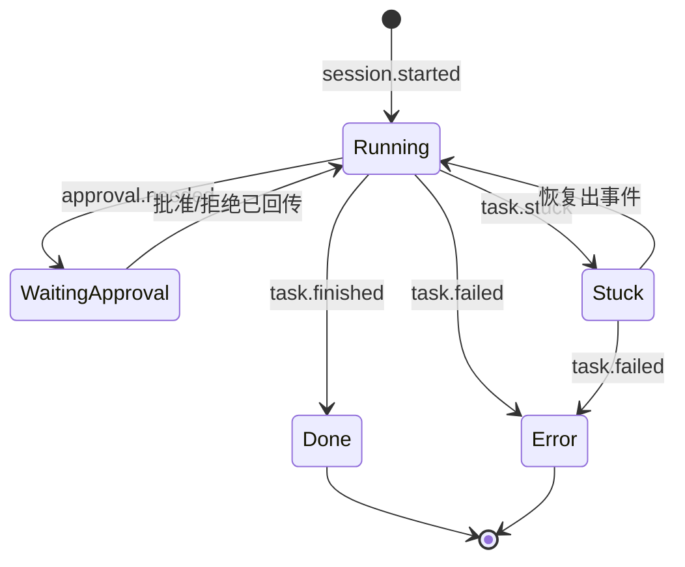

# 设计:任务状态机与播报事件管线

> Agent Earpiece · Desktop Agent 核心逻辑
> 日期:2026-06-10 · 状态:已认可(2026-06-10)

## 目的与范围

Desktop Agent 驾驶一个 CLI 会话(`claude -p --output-format stream-json`,
Codex 同构),把原始事件流**归一 → 过滤 → 合并 → 翻译成人话 → 推送**,
最终由 iPhone 经 APNs 让 Siri 在 AirPods 里念出来。

本 spec 只定义**事件归一、状态机、5 级播报过滤、播报队列**这四块纯逻辑,
不含送达层(APNs/WebSocket)、不含 iOS 端实现。

## 一、归一事件(CLI 无关)

原始 stream-json 事件先归一成 8 个内部事件。Codex 的事件往同一套靠。

| 内部事件 | 来自原始流 | 底线 | 坏消息 | 含义 |
|---|---|:--:|:--:|---|
| `session.started` | system/init | | | 任务开跑 |
| `progress.text` | assistant 文字 | | | Agent 说的人话(现成播报词) |
| `tool.started` | tool_use | | | 要用某工具(带「危险否」标记) |
| `tool.finished` | tool_result(成功) | | | 工具完成 |
| `tool.finished`(失败) | tool_result(失败) | | ★ | 单个工具失败,Agent 可能继续 |
| `approval.needed` | 权限回调 | ★ | | 要批准,**暂停等用户** |
| `task.finished` | result(成功) | ★ | | 整个任务做完 |
| `task.failed` | result(失败)/崩溃 | ★ | ★ | 任务出错/挂了 |
| `task.stuck` | 超时无事件 | ★ | ★ | 长时间无进展(默认 90s 无事件,可调) |

- **底线(★ 底线)**:`approval.needed` / `task.finished` / `task.failed` / `task.stuck`
  —— 任何级别都播。
- **坏消息(★ 坏消息)**:任何失败/报错类 —— 无视级别一律播(提级)。

## 二、状态机(从事件长出来,不拍脑袋定)



四个稳定态 + 一个 `Stuck` 旁支(`task.stuck` 触发,出新事件即回 `Running`)。
手机 / 手表显示的就是这个状态。`WaitingApproval` 期间任务真的暂停,等手机响应。

## 三、5 级播报过滤

底线 4 个事件永远播。中间事件按滑块分层:

| 级别 | 在上一级基础上加 | 听感 |
|---|---|---|
| **1 安静** | (只有底线) | 几乎不响 |
| **2** | + `session.started` | 知道它接了活 |
| **3** | + `progress.text` | 像有人时不时汇报 |
| **4** | + 每个 `tool.started`/`tool.finished` | 每一步都听到 |
| **5 话痨** | + 静默心跳(超过 M 秒没播任何东西就强制汇报一次) | 喋喋不休 |

心跳是**静默填充**:4 级已经每个工具都播,5 级的心跳只在长操作/长思考导致
冷场时补一句「还在跑 X,已 Y 分钟」,默认 M=60s,可调。

### 过滤判定顺序(每个事件进来跑一遍)

```
1. 是底线?           → 播
2. 是坏消息(失败)?  → 播(提级,穿透所有级别)
3. 当前级别允许这类?  → 播
4. 否则               → 丢弃
```

**好消息看滑块,坏消息总穿透。**

## 四、播报队列(合并 / 跳读)

语音串行,念一句 2~4s;高级别下事件会超过语音速度。队列策略:

- **底线 + 坏消息**:永不丢、永不合并,插到队首优先念。
- **进度类**(`session.started`/`progress.text`/`tool.*`/心跳):落后时**合并概括**
  —— 把堆积的合成一句(「刚跑了 3 个工具,最新:测试通过」),保留最新一条的内容。
- 目标:**始终追上现实**,宁可漏掉中间几步,不要跑完了还在念半小时前的事。

## 五、翻译成人话

发生在 Desktop Agent 端、推送发出前(推送 body 就是被念的内容)。

- `progress.text` → **直接用 Agent 自己的话**(本就是人话),必要时 Haiku 压成一句。
- `tool.*` / `session.*` → 固定模板(「改完了 X」「测试跑完」「开始干活了」)。
- 每句**带项目名前缀**(「wiki: ……」),因为多项目并发,要分得清谁在说话。

## 六、参数默认值(都可调)

| 参数 | 默认 | 说明 |
|---|---|---|
| `stuck` 阈值 | 90s 无事件 | 触发 `task.stuck` |
| 心跳 M | 60s | 5 级:静默超过 M 秒强制汇报一次 |
| 队列追赶阈值 | 落后 3 条 | 超过就启动合并/跳读 |

## 七、暂不做(不影响本逻辑)

- 实时打断(架构保留,见整体决策 #3)
- 断线重连 + 事件缓存回放
- 多电脑寻址
- 「危险否」标记的具体判定 —— MVP 直接复用 CLI 自带权限系统(决策 #8),
  它要弹权限 = `approval.needed`,不另造风险分类器。

---

*依据 2026-06-10 头脑风暴。整体技术决策见项目记忆 agent-earpiece-decisions。*
